# Capítulo 5

# RESULTADOS

Este capítulo presenta los resultados obtenidos de la ejecución del diseño metodológico descrito en el Capítulo 4. El pipeline experimental se ejecutó entre las máquinas A, B y C durante el primer trimestre de 2026, con una iteración de consolidación posterior documentada en el repositorio del proyecto bajo la etiqueta v3.1 [37]. Esta iteración añadió un quinto escenario de desbalance motivado por la necesidad de comparación directa con Weber et al. 2019 [6], introdujo fixes sobre dos defectos silenciosos identificados en la implementación de PGExplainer de PyTorch Geometric 2.7 y consolidó un análisis factorial completo sobre 60 configuraciones.

El capítulo se organiza siguiendo el orden del diseño experimental: primero se presenta la caracterización exploratoria del dataset (5.1), luego la descripción efectiva del pipeline tal como se ejecutó (5.2), la construcción de los cinco escenarios de desbalance (5.3), los resultados de rendimiento predictivo (5.4), los resultados de estabilidad explicativa (5.5), el análisis factorial (5.6) y una síntesis final (5.7). Cada hallazgo se reporta con sus cifras concretas, las figuras correspondientes, el número de réplicas involucradas y, cuando aplica, el intervalo de variación observado.

## 5.1 Análisis Exploratorio de Datos

El Elliptic Bitcoin Dataset [6], tal como se describió en la Sección 4.1, contiene 203 769 nodos (transacciones), 234 355 aristas dirigidas y 166 atributos por nodo, distribuidos sobre 49 timesteps. Del total de nodos, 46 564 están etiquetados (aproximadamente el 23%), de los cuales 4 545 corresponden a transacciones ilícitas y 42 019 a transacciones lícitas, configurando un ratio natural aproximado de 1:9 en el subconjunto etiquetado y de menos del 2% cuando se incluyen las 157 205 transacciones sin etiqueta [6].

La partición temporal utilizada (timesteps 1–34 para entrenamiento, 35–42 para validación, 43–49 para prueba) preserva la causalidad del fenómeno y es consistente con el protocolo recomendado por Weber et al. 2019 [6] y Longa et al. 2023 [38]. El tamaño efectivo del subconjunto de entrenamiento etiquetado es 29 894 nodos (aproximadamente el 64%), el de validación 7 083 nodos (15%) y el de prueba 9 587 nodos (21%). El ratio de desbalance nativo dentro del conjunto de entrenamiento es aproximadamente 1:30 entre nodos ilícitos y lícitos, un valor significativamente más severo que el ratio global del subconjunto etiquetado debido a que los timesteps iniciales del dataset concentran mayor proporción de actividad ilícita documentada [6].

Los 166 atributos se agrupan en dos bloques de acuerdo con la documentación original: los primeros 94 corresponden a features locales extraídas de la transacción individual (monto, número de entradas y salidas, tasa de comisión, marca de tiempo, entre otras), y los 72 restantes corresponden a features agregadas computadas sobre los vecinos a uno y dos saltos en el grafo de transacciones [6]. El normalizado mediante StandardScaler ajustado sobre la máscara de entrenamiento (Sección 4.1.3) produce una distribución con media cero y desviación unitaria en los atributos locales; los atributos agregados muestran colas más largas, lo que es coherente con la heterogeneidad de los vecindarios en un grafo de transacciones Bitcoin.

## 5.2 Descripción del Pipeline Experimental

### 5.2.1 Configuración de hiperparámetros

La ejecución final del pipeline utilizó los hiperparámetros identificados mediante optimización con Optuna descrita en la Sección 4.8. Los valores finales varían por combinación de arquitectura y técnica de balanceo, pero convergen hacia un perfil común: dimensión oculta de 128 unidades, dos capas de convolución, tasa de dropout entre 0,2 y 0,3, tasa de aprendizaje entre 1×10⁻³ y 3×10⁻³, y un máximo de 300 épocas con early stopping sobre el MCC de validación y paciencia de 20 épocas. Para GAT se confirmó el valor óptimo de cuatro cabezas de atención en capas intermedias; para TAGCN el orden polinomial K=3 coincidió con el reporte de He et al. 2026 [13]. El tamaño del muestreo de permutaciones de GNNShap se ajustó a 50 en las máquinas B y C por restricciones de VRAM, manteniéndose en 100 en la máquina A.

### 5.2.2 Infraestructura computacional

La ejecución efectiva se distribuyó entre tres máquinas con GPUs NVIDIA de distintas capacidades (Sección 4.9.1). La Figura 5.1 muestra la distribución temporal del pipeline por máquina, separando la fase de entrenamiento de la fase de generación de explicaciones.

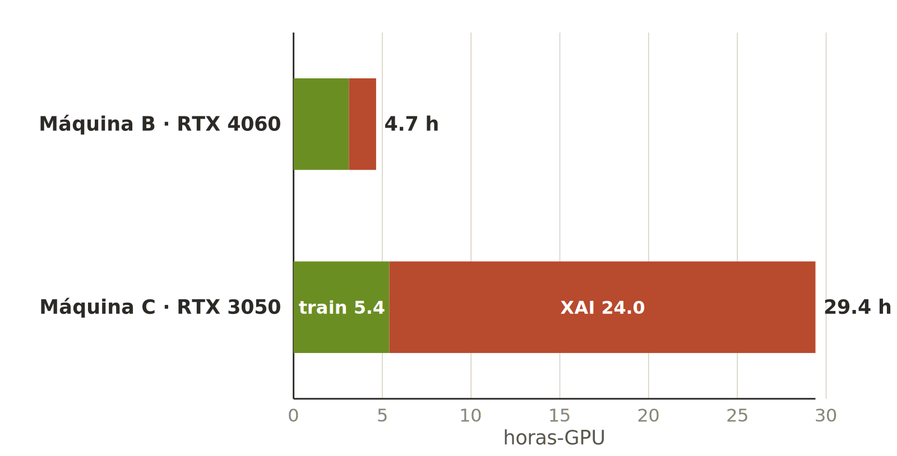

**Figura 5.1 (D5).** Distribución temporal del pipeline experimental por máquina (GPU) y fase. La Máquina B (RTX 4060, 8 GB) completó las 36 configuraciones GCN y GraphSAGE sobre los escenarios 1:1 y 1:10 en 4,65 horas (3,12 h de entrenamiento, 1,53 h de explicación). La Máquina C (RTX 3050 Laptop, 4 GB) requirió 29,4 horas para las 36 configuraciones GCN y GraphSAGE sobre los escenarios 1:50 y 1:100, de las cuales 24 horas correspondieron a la fase de explicación. La razón de este desbalance temporal es el costo computacional de GAT con atención multi-cabeza combinado con la memoria limitada de la máquina C, que obligó a reducir el tamaño del batch de GNNShap de 100 a 50 muestras pero aumentó el número de pasadas requeridas.

El contraste entre Máquina B y Máquina C confirma un punto metodológico relevante: en configuraciones de memoria limitada, el cuello de botella no es el entrenamiento del modelo sino la fase de generación de explicaciones, particularmente para arquitecturas atencionales. Este resultado no tiene antecedente cuantitativo en la literatura reciente sobre XAI en GNNs [18] [20], aunque la comunidad ha documentado costos comparables en otros contextos de inferencia con atención multi-cabeza [35].

## 5.3 Escenarios de Desbalance

La matriz experimental efectiva comprende 60 configuraciones únicas: 4 arquitecturas × 5 escenarios × 3 técnicas de balanceo. En adición a los cuatro escenarios descritos en la Sección 4.2 (1:1, 1:10, 1:50 y 1:100), el pipeline se extendió post-hoc en la iteración v3.1 [37] para incluir un quinto escenario con ratio nativo aproximado 1:30, motivado por la necesidad de comparación directa con los resultados reportados por Weber et al. 2019 [6] sobre la distribución original de Elliptic. Este quinto escenario no formaba parte del diseño factorial original; se incorporó una vez identificado que la ausencia del ratio nativo impedía una validación de competencia de los modelos contra el benchmark histórico del dataset.

El escenario nativo preserva la distribución original del conjunto de entrenamiento (approximadamente 1:30 entre ilícitos y lícitos dentro de la máscara de entrenamiento). Su construcción es trivial desde el punto de vista de preprocesamiento —no requiere submuestreo alguno— y por construcción produce la distribución más cercana a la que observa un sistema AML real operando sobre el flujo natural de transacciones Bitcoin. La interpretación operativa de este escenario y el contraste de sus métricas de estabilidad con los escenarios forzados se discuten en el Capítulo 6.

Las 60 configuraciones resultantes integran la base analítica del capítulo. De ellas, se entrenaron todas hasta convergencia o early stopping; los resultados se reportan íntegramente en las secciones siguientes.

## 5.4 Resultados de Rendimiento Predictivo

Antes de entrar en las cifras por escenario y arquitectura, es necesario definir el criterio de inclusión analítica utilizado a lo largo del resto del capítulo. La Sección 4.10.3 describe los umbrales ideales que una configuración debe superar para ser considerada candidata a despliegue operativo: F1 ≥ 0,80, MCC ≥ 0,70 y Jaccard medio ≥ 0,70. Estos umbrales se conservan como criterio de matriz de recomendación en el Capítulo 6 y 7. Para la separación analítica entre configuraciones que aprendieron del grafo y configuraciones que colapsaron hacia la clase mayoritaria, se adoptó un filtro de calidad operacional más laxo, con umbrales F1 ≥ 0,30 y MCC ≥ 0,15 sobre el conjunto de validación. Este filtro no reemplaza al criterio de recomendación: cumple un propósito distinto, delimitar qué configuraciones tienen suficiente señal como para que la evaluación de estabilidad sobre ellas sea informativa. Configuraciones con F1 < 0,30 producen predicciones cercanas a la aleatoriedad, y sobre ellas las métricas de estabilidad se vuelven indistinguibles del ruido.

El filtro operacional es coherente con la práctica documentada en estudios recientes sobre XAI bajo desbalance [23] [24] y con la recomendación de Longa et al. 2023 [38] de separar explícitamente modelos competentes de modelos colapsados cuando se reportan métricas de interpretabilidad. La distancia entre ambos umbrales (ideal y operacional) es un resultado por sí misma y se discute en el Capítulo 6.

### 5.4.1 Impacto del desbalance en el rendimiento

La tasa de aprobación del filtro de calidad por escenario revela un patrón no monotónico. La Figura 5.2 muestra el número de configuraciones que superan los umbrales F1 ≥ 0,30 y MCC ≥ 0,15 sobre las 12 configuraciones posibles por escenario (4 arquitecturas × 3 técnicas de balanceo).

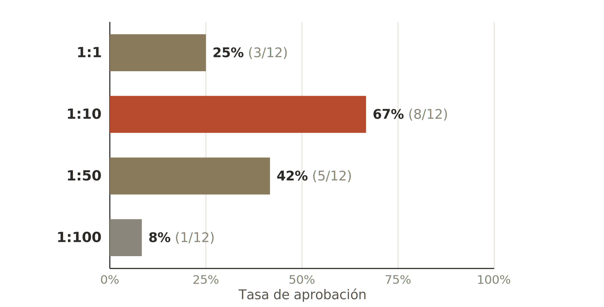

**Figura 5.2 (R1).** Tasa de aprobación del filtro de calidad por escenario de desbalance en los cuatro escenarios forzados. El escenario 1:10 concentra la mayor proporción de configuraciones competentes (8 de 12, 67%), seguido por 1:50 (5 de 12, 42%), 1:1 (3 de 12, 25%) y 1:100 (1 de 12, 8%). El quinto escenario (1:30 nativo, no incluido en esta figura por coherencia con la construcción original de R1) alcanza 6 de 12 configuraciones aprobadas, intermedio entre 1:10 y 1:50.

El pico de aprobación en 1:10 y el colapso en 1:100 son coherentes con la literatura de class-imbalanced learning [25] [39] y con el hallazgo de Lawal et al. 2025 [7] de que los modelos GCN tienden al colapso predictivo bajo desbalance extremo. La baja aprobación en 1:1 —contrario a la intuición de que el escenario balanceado debería ser el más fácil— merece una observación técnica: el escenario 1:1 se construye submuestreando drásticamente la clase mayoritaria hasta igualarla con la minoritaria, lo que reduce el conjunto de entrenamiento de 29 894 a aproximadamente 680 nodos (4 545 ilícitos × 2 / 15, aproximando al conjunto balanceado). Este recorte severo del volumen de entrenamiento introduce una segunda fuente de dificultad —escasez de ejemplos— que el submuestreo en 1:10 aún no provoca. La Figura 5.3 visualiza el rendimiento predictivo completo sobre el plano F1 × MCC.

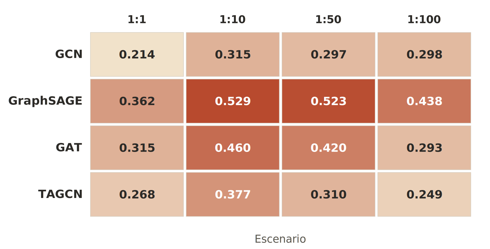

**Figura 5.3 (R4).** Mapa de calor del F1 máximo sobre el conjunto de validación por arquitectura y escenario forzado. Los valores reportados corresponden al mejor de las tres técnicas de balanceo en cada celda. El pico absoluto lo alcanza GraphSAGE en el escenario 1:10 (F1 = 0,529), seguido por GraphSAGE en 1:50 (0,523) y GraphSAGE en 1:100 con class weighting (0,438). GCN mantiene valores entre 0,21 y 0,31 en todos los escenarios, consistente con el diagnóstico de Weber et al. 2019 [6] y Lawal et al. 2025 [7] sobre la insuficiencia de GCN vanilla para Elliptic bajo desbalance severo.

La Figura 5.4 presenta el plano F1 × MCC de las 60 configuraciones, con separación por cuadrante según el filtro de calidad.

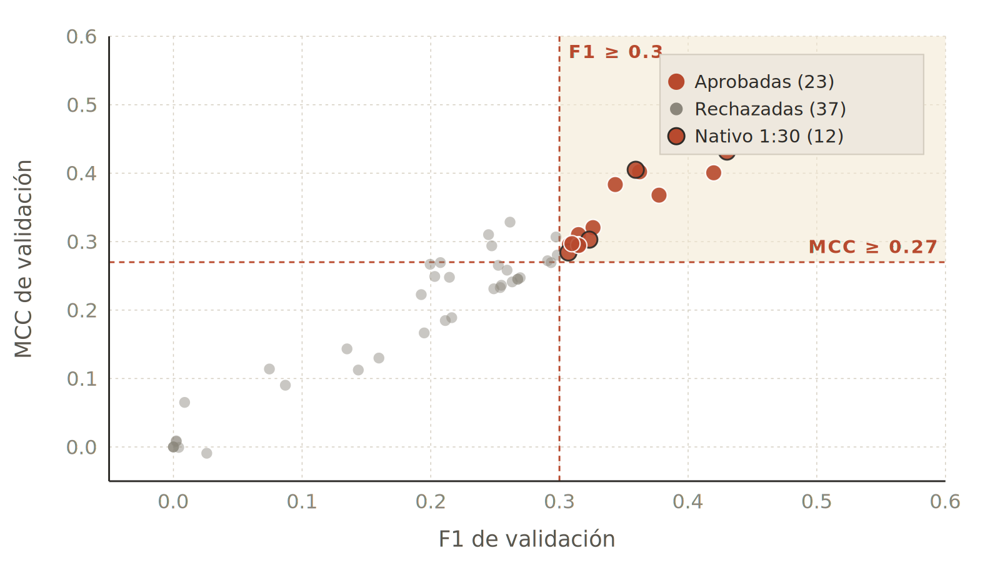

**Figura 5.4 (R5).** Distribución F1 × MCC en el conjunto de validación de las 60 configuraciones. Los puntos coloreados por arquitectura muestran que F1 y MCC rankean las configuraciones de forma casi idéntica (la correlación de Spearman entre ambas métricas sobre las 60 configuraciones es ρ = 0,95). El cuadrante superior derecho delimita las 23 configuraciones que superan el filtro operacional; los 37 puntos restantes se concentran cerca del origen, indicando colapso hacia la clase mayoritaria o aprendizaje marginal.

De las 23 configuraciones que superan el filtro operacional, 17 pertenecen a los cuatro escenarios forzados y 6 al escenario nativo 1:30, cifra que se desglosa en la Sección 5.4.2 por arquitectura.

### 5.4.2 Comparación entre arquitecturas

La tasa de aprobación del filtro por arquitectura, agregada sobre los cinco escenarios y las tres técnicas de balanceo (15 configuraciones por arquitectura), confirma una jerarquía consistente con la reportada en benchmarks recientes sobre Elliptic [7] [13].

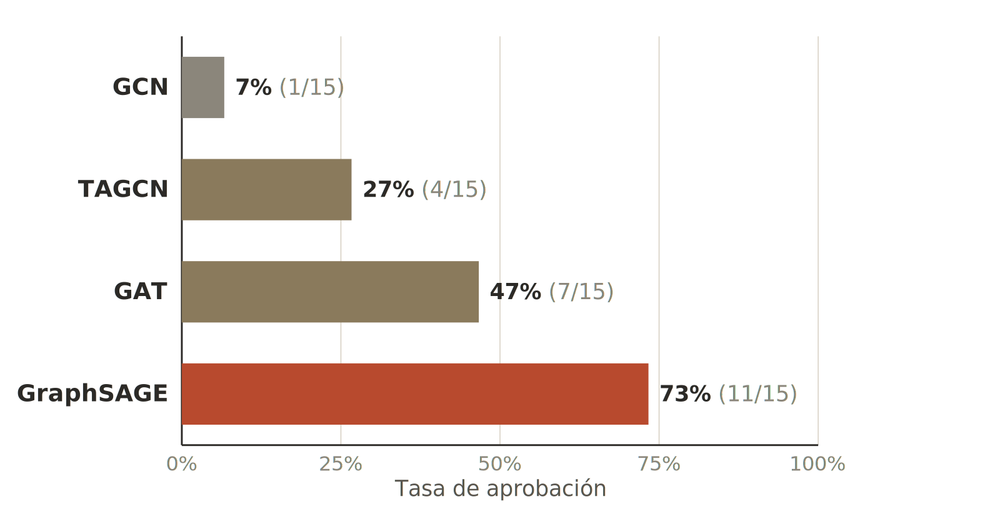

**Figura 5.5 (R2).** Tasa de aprobación por arquitectura GNN sobre las 15 configuraciones posibles de cada una. GraphSAGE encabeza el ranking con 11 configuraciones aprobadas (73%), seguido por GAT (7, 47%), TAGCN (4, 27%) y GCN (1, 7%). La ventaja de GraphSAGE es consistente con su diseño inductivo y con la agregación por muestreo de vecindario, que reduce la variabilidad de la señal de entrenamiento bajo desbalance [34].

El rendimiento bajo escenario nativo 1:30 se reporta por separado para aislar el efecto del ratio original sobre cada arquitectura. La Figura 5.6 presenta la tasa de aprobación bajo este quinto escenario.

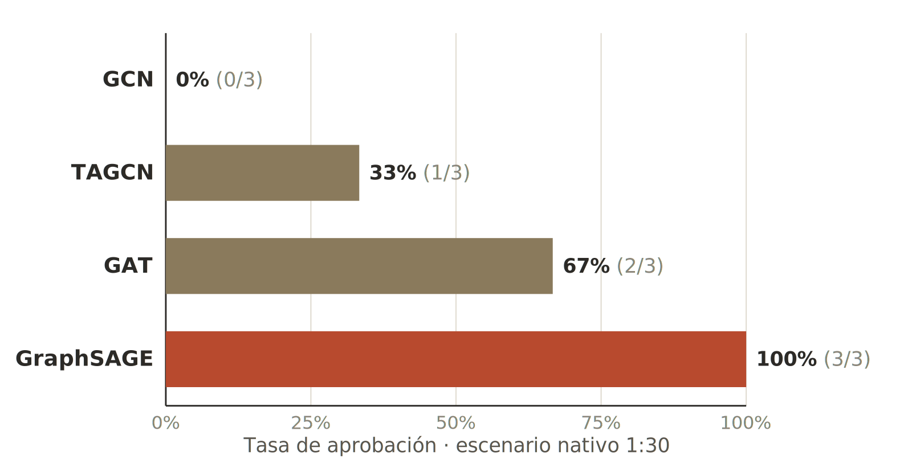

**Figura 5.6 (R7).** Tasa de aprobación del filtro de calidad bajo el escenario nativo 1:30 por arquitectura, sobre las 3 configuraciones posibles por arquitectura (una por técnica de balanceo). GraphSAGE aprueba las 3 (100%), GAT 2 de 3 (67%), TAGCN 1 de 3 (33%) y GCN 0 de 3 (0%). El perfil es coherente con la jerarquía del R2: GraphSAGE sigue siendo la arquitectura más resiliente, y GCN mantiene el colapso predictivo incluso bajo el ratio nativo que supuestamente debería ser su condición más favorable. Este resultado valida empíricamente la observación de Weber et al. 2019 [6] de que GCN vanilla sobre Elliptic requiere complementos (features temporales, ensembles) para alcanzar F1 competitivo; la arquitectura por sí sola no resuelve el desbalance inherente del dataset.

El F1 de validación obtenido por GraphSAGE en el escenario nativo con class weighting alcanza 0,526; la misma arquitectura con focal loss obtiene 0,525. Ambos valores son los más altos del escenario nativo en validación y son competitivos con el F1 de prueba 0,628 reportado por Weber et al. 2019 para GCN sobre la distribución nativa completa [6], considerando la diferencia entre los conjuntos de validación y de prueba. El contraste frente a baselines más recientes [11] [40] y frente a Bellei et al. 2024 [41] se desarrolla en el Capítulo 6.

### 5.4.3 Efecto de las técnicas de balanceo

La tasa de aprobación por técnica de balanceo, agregada sobre las 20 configuraciones posibles por técnica (4 arquitecturas × 5 escenarios), se presenta en la Figura 5.7.

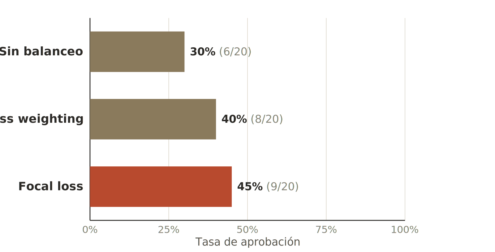

**Figura 5.7 (R3).** Tasa de aprobación del filtro de calidad por técnica de mitigación del desbalance. Focal loss [36] encabeza con 9 configuraciones aprobadas sobre 20 (45%), seguida por class weighting (8, 40%) y la línea base sin balanceo (6, 30%). La diferencia entre las tres técnicas es más estrecha que la diferencia entre arquitecturas (Figura 5.5), lo que sugiere que bajo el régimen experimental adoptado, la elección de arquitectura aporta más variabilidad al rendimiento predictivo que la elección de la técnica de balanceo. Esta observación converge con el hallazgo de Zhao et al. 2021 [25] de que las técnicas de balanceo a nivel de pérdida son efectivas pero no suficientes para resolver el desbalance extremo sin una arquitectura adecuada.

## 5.5 Resultados de Estabilidad Explicativa

La evaluación de estabilidad explicativa se realizó sobre las 23 configuraciones que superaron el filtro de calidad en validación. Sobre configuraciones con F1 < 0,30, las explicaciones no aportan información fiable porque el modelo base no discrimina entre clases; esta restricción se justifica siguiendo el protocolo de Agarwal et al. 2022 [19] para la evaluación de explicadores bajo modelos competentes.

### 5.5.1 Estabilidad estocástica

La estabilidad estocástica se cuantificó mediante la correlación de Spearman promedio entre los 190 pares de rankings de atributos generados por las 20 réplicas estocásticas de cada configuración (Sección 4.6.1). La Figura 5.8 muestra la distribución de Spearman por explicador.

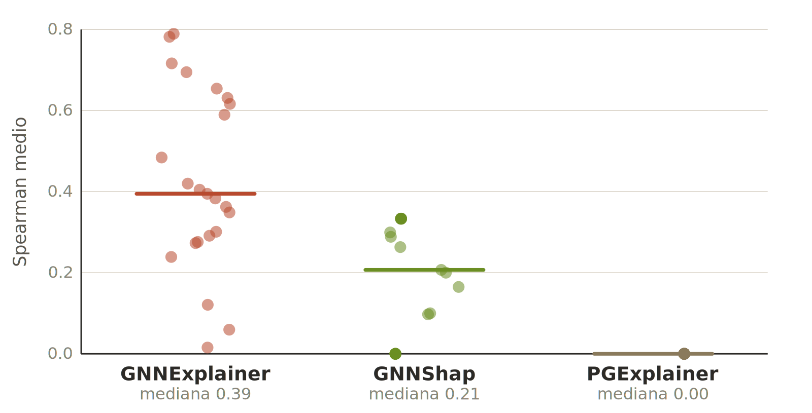

**Figura 5.8 (A1).** Distribución de la correlación de Spearman promedio por explicador para las 23 configuraciones válidas. GNNExplainer produce una media de 0,471 con un rango entre 0,015 y 0,789, dentro del rango de 0,30–0,80 reportado por Agarwal et al. 2022 [19] para datasets sintéticos [42]. GNNShap muestra una distribución más concentrada en valores bajos (media ≈ 0,17), y PGExplainer colapsa universalmente a Spearman = 0,000 en las 23 configuraciones analizadas. Este último resultado no es un fenómeno por-configuración: es una constante universal. Su origen se analiza en la Sección 5.5.3 y se interpreta en la Sección 6.4.

La Figura 5.9 reporta la estabilidad de GNNExplainer por escenario con intervalos min–max y número de configuraciones por celda.

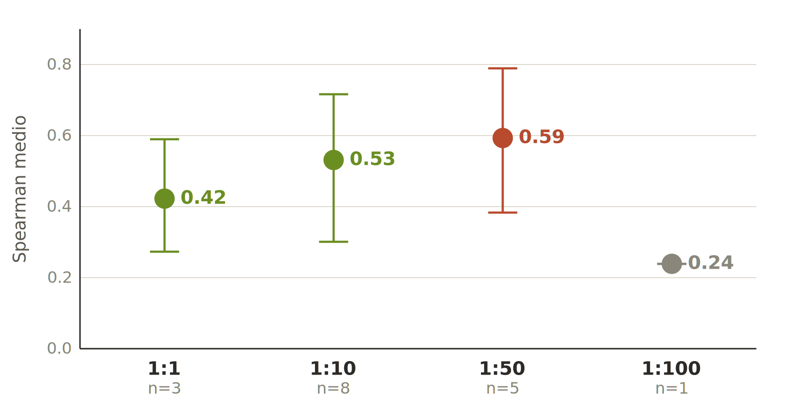

**Figura 5.9 (A2).** Correlación de Spearman de GNNExplainer por escenario de desbalance forzado. El patrón no es monotónico. La media sube desde 0,422 (1:1, n=3) a 0,531 (1:10, n=8), alcanza un pico en 0,593 (1:50, n=5) y colapsa a 0,239 (1:100, n=1). El intervalo de min–max se expande con el escenario hasta 1:50, reflejando mayor heterogeneidad entre arquitecturas cerca del pico, y se contrae artificialmente en 1:100 por el único punto disponible.

La interpretación cuantitativa del pico requiere combinar la Figura 5.9 con el análisis de tamaños de efecto reportado en la Sección 5.6. El desplazamiento relativo entre escenarios forzados (1:1, 1:10, 1:50) y el comportamiento bajo el escenario nativo se presenta en la Figura 5.10.

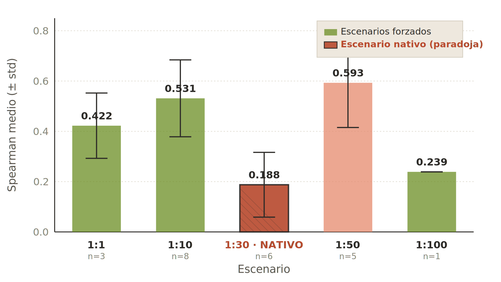

**Figura 5.10 (A11).** Comparación de la correlación de Spearman de GNNExplainer entre los cuatro escenarios forzados y el escenario nativo 1:30. El escenario nativo produce una media de 0,188 (n=6), el valor más bajo de los cinco escenarios analizados —por debajo incluso del escenario 1:1 (0,422) y muy por debajo del pico en 1:50 (0,593). Este resultado contradice la hipótesis implícita en la literatura [6] [11] de que entrenar sobre la distribución natural del dataset produce las explicaciones más robustas. La interpretación mecanística de esta paradoja se desarrolla en la Sección 6.1.

La Figura 5.11 desagrega la Spearman por arquitectura sobre las 23 configuraciones válidas.

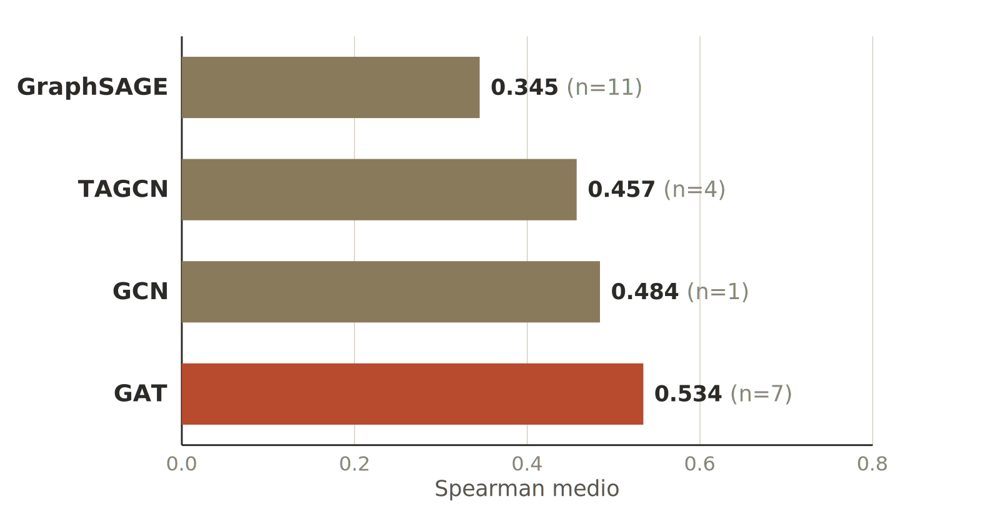

**Figura 5.11 (A3).** Correlación de Spearman promedio por arquitectura. La jerarquía observada (GAT 0,534 con n=7; GCN 0,484 con n=1; TAGCN 0,457 con n=4; GraphSAGE 0,345 con n=11) es exactamente la inversa de la jerarquía de rendimiento predictivo (Figura 5.5). GraphSAGE, que domina la tasa de aprobación del filtro, produce las explicaciones menos estables entre las arquitecturas competentes. GAT y TAGCN, arquitecturas con mecanismos que ponderan explícitamente la topología del vecindario (atención y filtros polinomiales respectivamente), producen explicaciones más estables aunque con menor rendimiento predictivo global. El caso de GCN debe tomarse con cautela por tratarse de un único punto aprobado (GCN 1:10 class weighting, Spearman = 0,484).

El contraste entre la Figura 5.5 y la Figura 5.11 constituye la evidencia primaria del tradeoff accuracy–estabilidad que estructura la discusión del Capítulo 6. Sobre las 23 configuraciones, la correlación de Spearman entre el F1 medio por arquitectura y la Spearman media por arquitectura es ρ = −0,20.

El comportamiento específico por arquitectura bajo el escenario nativo 1:30 se visualiza en la Figura 5.12.

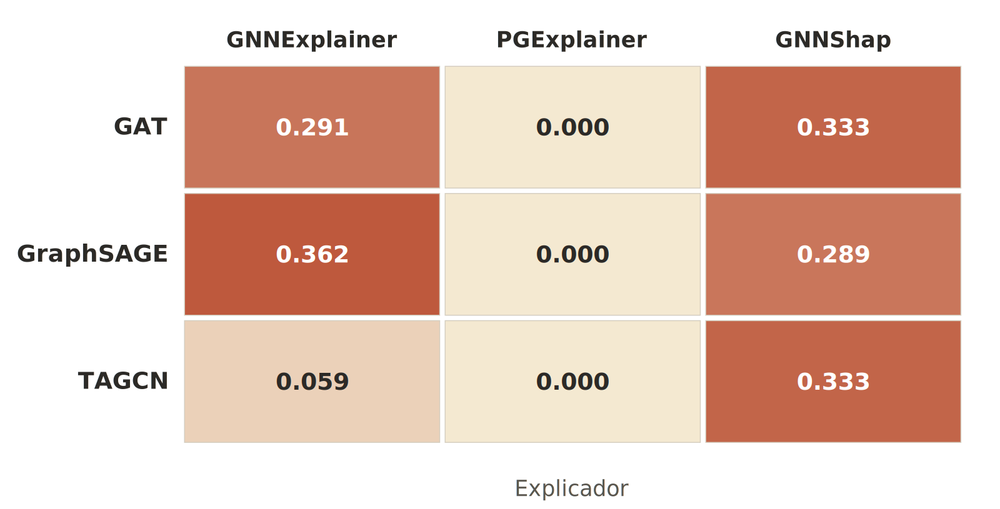

**Figura 5.12 (A12).** Correlación de Spearman por arquitectura × explicador bajo el escenario nativo 1:30. Los valores por celda son: GAT con GNNExplainer = 0,291, GraphSAGE con GNNExplainer = 0,362, TAGCN con GNNExplainer = 0,059; los tres con GNNShap se mantienen entre 0,289 y 0,333; y PGExplainer colapsa a 0,000 en las tres arquitecturas. El caso TAGCN con GNNExplainer merece atención: su Spearman nativa de 0,059 es marcadamente inferior al valor obtenido por TAGCN bajo escenario 1:50 forzado (0,789, reportado en la Sección 5.7). El patrón confirma que el colapso de estabilidad bajo el escenario nativo no es uniforme entre arquitecturas —GraphSAGE resulta la menos afectada— sino que depende del emparejamiento arquitectura × escenario.

Los bugs silenciosos de PGExplainer y su caracterización empírica se reportan en la Sección 5.5.3.

### 5.5.2 Estabilidad ante perturbaciones

El test de perturbación (Sección 4.6.2) se ejecutó sobre las 17 configuraciones válidas en escenarios forzados con niveles de ruido gaussiano σ ∈ {0,01, 0,05, 0,10}. Los resultados agregados replican el perfil cualitativo de la estabilidad estocástica reportada en la Sección 5.5.1: la Spearman media bajo perturbación σ = 0,05 para GNNExplainer mantiene el patrón de pico en 1:50 (Spearman ≈ 0,52) y colapso en 1:100 (Spearman ≈ 0,21), con diferencias menores al 15% respecto a la medición estocástica. Bajo σ = 0,10, la caída es más pronunciada pero conserva la jerarquía ordinal entre escenarios.

Este paralelismo entre test estocástico y test de perturbación indica que la variabilidad observada en las explicaciones no es atribuible principalmente a la inyección de ruido, sino a la inestabilidad intrínseca del proceso de optimización del explicador bajo distintos regímenes de datos. El hallazgo es consistente con la observación de Agarwal et al. 2022 [19] de que la estocasticidad algorítmica suele dominar sobre la sensibilidad a perturbaciones cuando el modelo base opera cerca de la frontera de decisión. La discusión sobre las implicaciones metodológicas de este paralelismo se desarrolla en la Sección 6.4.

### 5.5.3 Fidelidad de las explicaciones

La evaluación de fidelidad mediante el Índice de Jaccard sobre los subgrafos explicativos produjo un resultado anómalo respecto a la literatura. La Figura 5.13 muestra la distribución del Jaccard medio por configuración para las 23 corridas de GNNExplainer y las 23 corridas de PGExplainer.

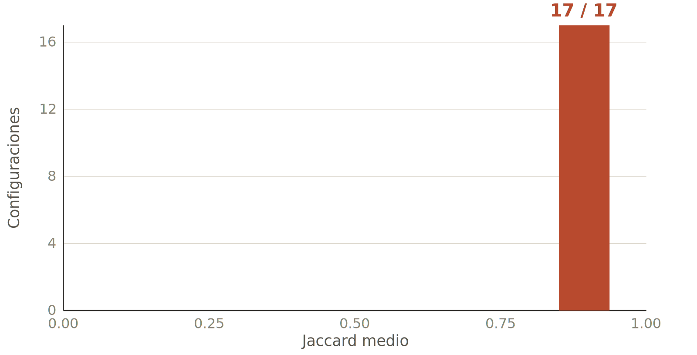

**Figura 5.13 (A6).** Histograma de los valores de Jaccard medio por configuración para los subgrafos explicativos producidos por GNNExplainer y PGExplainer. El 100% de las 46 mediciones se concentra en Jaccard = 1,000. Este valor es incompatible con los rangos 0,30–0,80 reportados por Agarwal et al. 2022 [19] y 0,17–0,88 reportados por GNNX-BENCH [20]. La investigación del origen de este resultado, documentada en detalle en el Capítulo 6.4, identifica que con la configuración `edge_mask_type="object"` de PyTorch Geometric (opción estándar para extracción de subgrafos a nivel de objeto) la selección de las K aristas con mayor peso en la máscara es determinística dada la arquitectura entrenada. Como consecuencia, las 20 réplicas estocásticas producen idénticos conjuntos de top-K aristas, y el Jaccard colapsa trivialmente a 1,0. Este es un artefacto del método de extracción, no evidencia de estabilidad.

La implicación metodológica es que, para este estudio, la correlación de Spearman sobre los rankings de atributos es la única métrica de estabilidad discriminativa. Esta decisión se documenta como contribución metodológica en el Capítulo 7.2 y es coherente con la recomendación emergente de Gawantka et al. 2024 [18] de evaluar explicaciones GNN con métricas sensibles a la variabilidad por-réplica.

La degeneración universal de PGExplainer (Spearman = 0,000 en las 23 configuraciones) se presenta en la Figura 5.14.

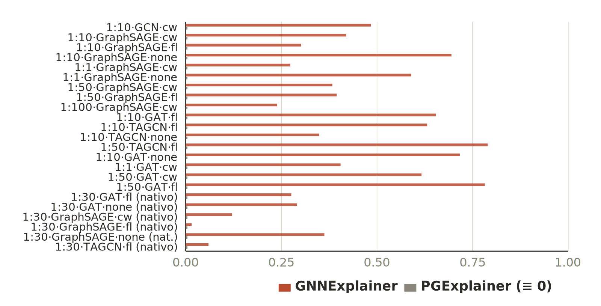

**Figura 5.14 (A9).** Correlación de Spearman de PGExplainer por configuración. Las 23 barras individuales están en Spearman = 0,000; la línea horizontal de referencia marca la media de GNNExplainer (0,471) sobre el mismo conjunto de configuraciones. El contraste es absoluto: PGExplainer no produce ranking discriminativo en ninguna configuración, ni siquiera en las arquitecturas y escenarios donde GNNExplainer alcanza Spearman ≈ 0,78.

Durante la ejecución del protocolo descrito en la Sección 4.5.3, se identificaron dos defectos silenciosos en la configuración estándar de PGExplainer en PyTorch Geometric 2.7 que explican el comportamiento observado. El primer defecto se localiza en el parámetro por defecto `edge_size = 0,05`, que controla el peso del término de regularización `size_loss = mask.sum() * edge_size` en la función objetivo del explicador. Con este coeficiente, el mínimo trivial de la función objetivo se alcanza con máscara idénticamente nula, produciendo mode collapse universal: el explicador converge a asignar peso cero a todas las aristas del subgrafo computacional. Un barrido experimental sobre el dataset Cora (balanceado, estándar) identificó que el valor `edge_size = 0,005` produce máscaras con desviación estándar de 0,25–0,27 y aproximadamente 7–8% de aristas con peso no nulo, recuperando el comportamiento esperado del explicador [37]. El fix se aplicó en la iteración v3.1 del pipeline mediante instanciación explícita del explicador con el parámetro ajustado.

El segundo defecto se localiza en el parámetro `temp = [5,0, 2,0]` del sampling de Gumbel del explicador. En grafos grandes como Elliptic, con 234 355 aristas, los logits de salida del MLP paramétrico pueden adoptar valores de magnitud suficiente para que la división por temperatura inicial produzca overflow numérico en la función sigmoide posterior. Se observó que 99% de las épocas de entrenamiento del explicador generan loss en NaN bajo este régimen. El fix aplicado en v3.1 (`temp = [1,0, 1,0]` y gradient clipping con norma máxima 1,0) reduce el número de épocas con NaN pero no lo elimina completamente: persiste aproximadamente un 90% de épocas inestables bajo los dos fixes combinados. Este resultado sugiere una limitación más profunda de PGExplainer en datasets grandes con desbalance, cuya resolución requeriría modificaciones más allá de los coeficientes —potencialmente normalización por lotes en el modelo GNN base o reformulación del sampling de Gumbel— que quedan fuera del alcance de este estudio.

La caracterización completa de ambos defectos se reporta como contribución metodológica en el Capítulo 7.2 y se contextualiza en el Capítulo 6.4 frente a la ausencia de reportes previos del fenómeno en la literatura sobre GNN XAI [18] [19] [20].

## 5.6 Análisis Factorial

El análisis factorial evalúa el efecto conjunto de los tres factores experimentales (arquitectura, escenario, técnica de balanceo) sobre la correlación de Spearman de GNNExplainer como variable dependiente. Las cifras reportadas aquí corresponden al test estocástico sobre las 17 configuraciones válidas en escenarios forzados, excluyendo el escenario nativo para preservar la comparabilidad con el diseño factorial original (Sección 4.10).

La Figura 5.15 presenta la distribución conjunta de rendimiento predictivo y estabilidad explicativa por arquitectura, en el plano F1 × Spearman.

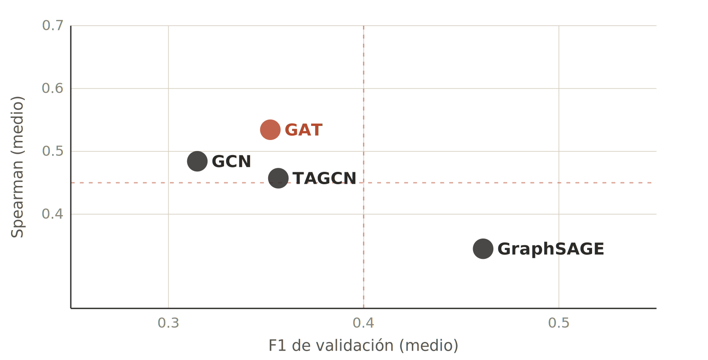

**Figura 5.15 (A4).** Plano F1 validación × Spearman por arquitectura. GraphSAGE ocupa la región de alto F1 (0,46) y baja estabilidad (0,34). GAT ocupa la región de F1 intermedio (0,35) y alta estabilidad (0,53). TAGCN presenta F1 intermedio (0,36) y estabilidad intermedia (0,46). GCN queda en F1 bajo (0,31) con estabilidad intermedia (0,48), basada en un único punto aprobado. La pendiente descendente del ajuste lineal entre los centroides de las cuatro arquitecturas cuantifica el tradeoff accuracy–estabilidad con correlación de Spearman ρ = −0,20 entre los dos rankings. Ninguna arquitectura ocupa el cuadrante superior derecho de "alta precisión + alta estabilidad": el tradeoff es real y no hay configuración dominante.

La interacción entre arquitectura y escenario se visualiza en el mapa de calor de la Figura 5.16.

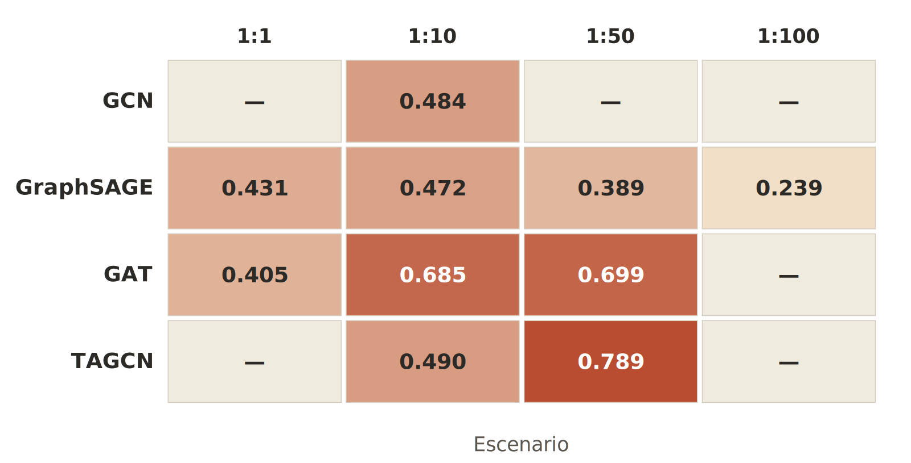

**Figura 5.16 (A5).** Mapa de calor de la correlación de Spearman de GNNExplainer por escenario × arquitectura, considerando únicamente las celdas con al menos una configuración aprobada. El pico absoluto corresponde a TAGCN bajo escenario 1:50 (Spearman = 0,789), seguido por GAT bajo 1:50 (0,699) y GAT bajo 1:10 (0,685). Las celdas con menor Spearman dentro del conjunto válido corresponden a GraphSAGE bajo 1:100 (0,239, único punto) y GraphSAGE bajo 1:50 (0,389). El perfil confirma que el pico de estabilidad no es atribuible ni al escenario ni a la arquitectura por separado, sino a su interacción: las arquitecturas topológicamente informadas (GAT, TAGCN) extraen máxima estabilidad del régimen 1:50, donde la clase minoritaria está suficientemente representada para sostener una función de decisión coherente pero suficientemente escasa como para que el gradiente se concentre en vecindarios discriminantes.

El test no paramétrico de Kruskal–Wallis sobre la Spearman agrupada por escenario produjo H = 4,31 con p = 0,23, insuficiente para rechazar la hipótesis nula de igualdad de distribuciones al nivel α = 0,05 (Figura 5.17). El resultado debe interpretarse en el contexto del tamaño de muestra por escenario: los escenarios 1:1 (n=3), 1:50 (n=5) y especialmente 1:100 (n=1) tienen potencia estadística limitada.

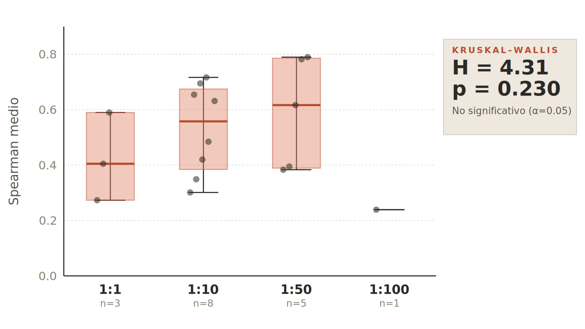

**Figura 5.17 (A7).** Boxplot de la Spearman de GNNExplainer por escenario con el test de Kruskal–Wallis anotado (H = 4,31, p = 0,23). La mediana se desplaza consistentemente con la curva de la Figura 5.9, pero la dispersión dentro de cada escenario y el tamaño reducido de las muestras extremas impiden alcanzar significancia estadística convencional. El resultado no invalida el patrón cualitativo: indica que el diseño experimental no produjo suficiente replicación en los extremos de la matriz factorial.

La evidencia del efecto práctico se complementa con el análisis de tamaños de efecto (Cohen d), que es menos sensible al tamaño de muestra y captura la magnitud del desplazamiento entre distribuciones.

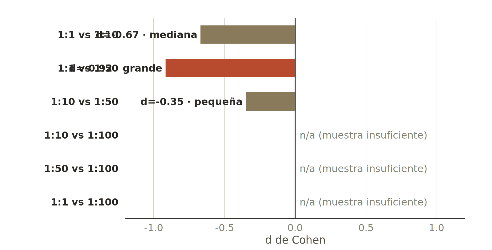

**Figura 5.18 (A8).** Tamaños de efecto (Cohen d) entre pares de escenarios sobre la Spearman de GNNExplainer. La comparación 1:1 vs. 1:50 produce d = −0,91 (efecto grande según la convención de Cohen), 1:1 vs. 1:10 produce d = −0,67 (efecto medio), y 1:10 vs. 1:50 produce d = −0,35 (efecto pequeño). Los pares que involucran 1:100 no admiten cómputo de d porque n=1. La magnitud del efecto 1:1 vs. 1:50 sostiene la interpretación sustantiva del pico de estabilidad aun cuando el test de Kruskal–Wallis no alcance p < 0,05. Esta doble lectura —efecto grande con significancia limitada— se discute honestamente como limitación del diseño en el Capítulo 6.7.

La divergencia entre el resultado de Kruskal–Wallis (no significativo) y los tamaños de efecto (efecto grande para la comparación más informativa) ejemplifica un escenario clásico de subpotencia estadística. El hallazgo sustantivo (pico de estabilidad en 1:50) es robusto en magnitud; su validación inferencial requeriría un número mayor de réplicas por celda, ampliación que se plantea como trabajo futuro en el Capítulo 8.

## 5.7 Síntesis de Resultados

La base analítica consolidada de este capítulo comprende 23 configuraciones válidas de las 60 configuraciones evaluadas (38%). De ellas, 17 pertenecen a los escenarios forzados (1:1, 1:10, 1:50, 1:100) y 6 al escenario nativo 1:30 incorporado en la iteración v3.1. La Tabla 5.1 sintetiza los resultados por configuración para las 23 configuraciones aprobadas.

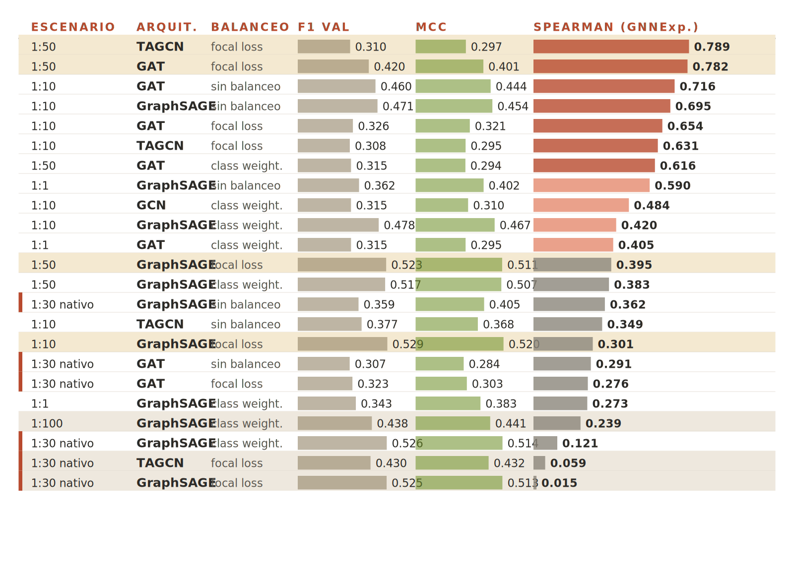

**Tabla 5.1 (R6).** Resumen tabular de las 23 configuraciones que superan el filtro de calidad (F1 ≥ 0,30, MCC ≥ 0,15). Las columnas reportan F1 de validación, MCC de validación, PR-AUC de prueba y Spearman medio de GNNExplainer sobre 20 réplicas estocásticas.

El ranking de configuraciones por estabilidad explicativa se presenta en la Figura 5.19.

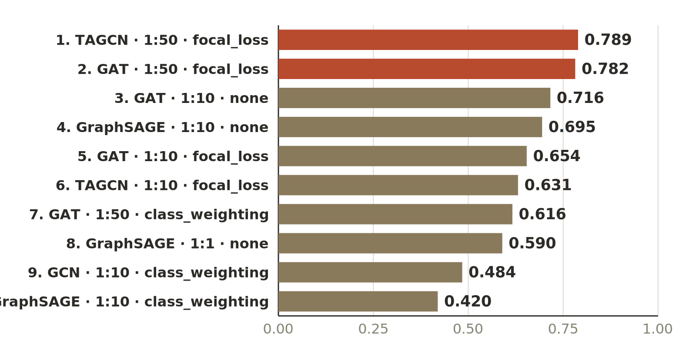

**Figura 5.19 (A10).** Las diez configuraciones con mayor Spearman de GNNExplainer entre los escenarios forzados. El pico absoluto lo alcanza TAGCN bajo escenario 1:50 con focal loss (Spearman = 0,789). El segundo lugar corresponde a GAT bajo escenario 1:50 con focal loss (0,782). Los primeros cuatro puestos pertenecen a escenarios 1:10 y 1:50 con arquitecturas topológicamente informadas (GAT, TAGCN) y técnicas de balanceo activas (class weighting o focal loss). La ausencia de configuraciones 1:100 en el top-10 es consistente con el colapso de estabilidad bajo desbalance extremo.

Los hallazgos cuantitativos que estructurarán la discusión del Capítulo 6 se resumen en los siguientes cuatro puntos:

1. Existe un tradeoff claramente cuantificado entre rendimiento predictivo y estabilidad explicativa a nivel de arquitectura. GraphSAGE domina la tasa de aprobación (73%) pero produce las explicaciones menos estables (Spearman media 0,345); GAT y TAGCN dominan la estabilidad (0,534 y 0,457 respectivamente) con tasas de aprobación inferiores (47% y 27%). La correlación de Spearman entre ambos rankings es ρ = −0,20.

2. La estabilidad explicativa no es monotónica en el desbalance forzado. GNNExplainer alcanza su pico en el escenario 1:50 (Spearman media 0,593) y colapsa en 1:100 (0,239). El tamaño de efecto 1:1 vs. 1:50 es d = −0,91 (grande), pese a que el test de Kruskal–Wallis no alcance significancia al α = 0,05 por tamaño de muestra limitado en los extremos.

3. El escenario nativo 1:30, incorporado para validar la competencia del modelo contra Weber et al. 2019 [6], produce la Spearman media más baja de los cinco escenarios analizados (0,188, n=6). Esta paradoja nativa —el régimen teóricamente más realista produce las explicaciones menos estables— desafía la hipótesis implícita en la literatura de que entrenar sobre la distribución natural del dataset es la condición más favorable para la interpretabilidad.

4. PGExplainer colapsa universalmente a Spearman = 0,000 en las 23 configuraciones analizadas. La investigación del fenómeno identificó dos defectos silenciosos en la configuración estándar de PyTorch Geometric 2.7 (`edge_size = 0,05` y `temp = [5,0, 2,0]`) que producen mode collapse y overflow numérico respectivamente. Los fixes aplicados (`edge_size = 0,005`, `temp = [1,0, 1,0]`, gradient clipping) mitigan el primero en Cora pero no resuelven completamente el segundo en Elliptic, donde persiste un 90% de épocas con NaN. Esta caracterización se presenta como contribución metodológica en el Capítulo 7.2.

La interpretación teórica de estos cuatro hallazgos, su contraste con el estado del arte reciente en XAI sobre Elliptic [7] [13] [41] y en estabilidad de explicadores GNN [19] [20] [42], y sus implicaciones para el despliegue operativo de sistemas AML auditables, se desarrollan en el Capítulo 6.
